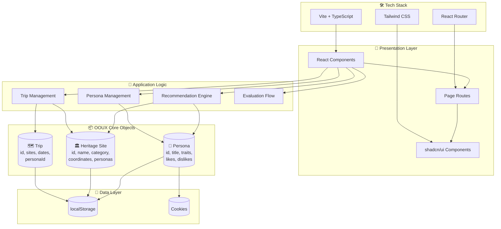

# CulturaPath Architecture

> Technical architecture diagrams and system design documentation.

---

## Table of Contents

1. [System Architecture](#system-architecture)
2. [Component Architecture](#component-architecture)
3. [Data Flow Diagrams](#data-flow-diagrams)
4. [Recommendation Engine](#recommendation-engine)
5. [Storage Architecture](#storage-architecture)

---

## System Architecture

### High-Level Overview

```
┌─────────────────────────────────────────────────────────────────────────────┐
│                         CULTURAPATH SYSTEM ARCHITECTURE                      │
├─────────────────────────────────────────────────────────────────────────────┤
│                                                                              │
│   ┌────────────────────────────────────────────────────────────────────┐    │
│   │                        PRESENTATION LAYER                           │    │
│   │  ┌─────────────┐  ┌─────────────┐  ┌─────────────┐  ┌───────────┐  │    │
│   │  │    Pages    │  │  Components │  │    UI Kit   │  │   Hooks   │  │    │
│   │  │  (Routes)   │  │  (Features) │  │ (shadcn/ui) │  │ (Custom)  │  │    │
│   │  └─────────────┘  └─────────────┘  └─────────────┘  └───────────┘  │    │
│   └────────────────────────────────────────────────────────────────────┘    │
│                                      │                                       │
│                                      ▼                                       │
│   ┌────────────────────────────────────────────────────────────────────┐    │
│   │                        APPLICATION LAYER                            │    │
│   │  ┌─────────────────┐  ┌─────────────────┐  ┌─────────────────────┐ │    │
│   │  │  Recommendation │  │     Persona     │  │       Trip          │ │    │
│   │  │     Engine      │  │    Management   │  │    Management       │ │    │
│   │  └─────────────────┘  └─────────────────┘  └─────────────────────┘ │    │
│   │  ┌─────────────────┐  ┌─────────────────┐  ┌─────────────────────┐ │    │
│   │  │   Evaluation    │  │      Study      │  │    Notification     │ │    │
│   │  │      Flow       │  │    Analytics    │  │      System         │ │    │
│   │  └─────────────────┘  └─────────────────┘  └─────────────────────┘ │    │
│   └────────────────────────────────────────────────────────────────────┘    │
│                                      │                                       │
│                                      ▼                                       │
│   ┌────────────────────────────────────────────────────────────────────┐    │
│   │                        OOUX CORE OBJECTS                            │    │
│   │                                                                      │    │
│   │     ┌──────────────┐     ┌──────────────┐     ┌──────────────┐      │    │
│   │     │              │     │              │     │              │      │    │
│   │     │   PERSONA    │────▶│ HERITAGE SITE│◀────│     TRIP     │      │    │
│   │     │              │     │              │     │              │      │    │
│   │     └──────────────┘     └──────────────┘     └──────────────┘      │    │
│   │                                                                      │    │
│   └────────────────────────────────────────────────────────────────────┘    │
│                                      │                                       │
│                                      ▼                                       │
│   ┌────────────────────────────────────────────────────────────────────┐    │
│   │                          DATA LAYER                                 │    │
│   │  ┌─────────────────┐  ┌─────────────────┐  ┌─────────────────────┐ │    │
│   │  │   localStorage  │  │     Cookies     │  │   Static Data       │ │    │
│   │  │  (Persistence)  │  │   (Consent)     │  │  (Heritage Sites)   │ │    │
│   │  └─────────────────┘  └─────────────────┘  └─────────────────────┘ │    │
│   └────────────────────────────────────────────────────────────────────┘    │
│                                                                              │
└─────────────────────────────────────────────────────────────────────────────┘
```

### Mermaid Diagram



---

## Component Architecture

### Feature Component Hierarchy

```
┌─────────────────────────────────────────────────────────────────────────────┐
│                        COMPONENT HIERARCHY                                   │
├─────────────────────────────────────────────────────────────────────────────┤
│                                                                              │
│   App.tsx                                                                    │
│   └── Routes                                                                 │
│       ├── Index.tsx (Landing)                                                │
│       │   ├── AppHeader                                                      │
│       │   ├── HeroSection                                                    │
│       │   └── BottomNav                                                      │
│       │                                                                      │
│       ├── Discover.tsx                                                       │
│       │   ├── AppHeader                                                      │
│       │   ├── PersonaFilterBar                                               │
│       │   │   └── GlassPersonaChip (×8)                                      │
│       │   ├── SiteGrid                                                       │
│       │   │   └── SiteCard (×n)                                              │
│       │   │       └── MatchScoreBadge                                        │
│       │   └── BottomNav                                                      │
│       │                                                                      │
│       ├── Planner.tsx                                                        │
│       │   ├── AppHeader                                                      │
│       │   ├── TripList                                                       │
│       │   │   └── TripCard (×n)                                              │
│       │   ├── PersonaRecommendations                                         │
│       │   └── BottomNav                                                      │
│       │                                                                      │
│       ├── Profile.tsx                                                        │
│       │   ├── AppHeader                                                      │
│       │   ├── MyPersonaTile                                                  │
│       │   ├── ScheduledVisitsList                                            │
│       │   │   └── StudyVisitCard (×n)                                        │
│       │   └── BottomNav                                                      │
│       │                                                                      │
│       ├── Onboarding/                                                        │
│       │   ├── Onboarding.tsx                                                 │
│       │   │   └── PersonaCard (×8)                                           │
│       │   ├── PersonaQuestionnaire.tsx                                       │
│       │   ├── PersonaResults.tsx                                             │
│       │   └── PersonaConfirmation.tsx                                        │
│       │                                                                      │
│       └── StudyDashboard.tsx                                                 │
│           ├── StudyEnrollment                                                │
│           ├── ACUXQuestionnaire                                              │
│           └── StudyAnalyticsDisplay                                          │
│                                                                              │
└─────────────────────────────────────────────────────────────────────────────┘
```

### UI Component Dependencies

```
┌─────────────────────────────────────────────────────────────────┐
│                    UI COMPONENT TREE                             │
├─────────────────────────────────────────────────────────────────┤
│                                                                  │
│   shadcn/ui (Base)                                               │
│   ├── Button                                                     │
│   ├── Card                                                       │
│   ├── Dialog                                                     │
│   ├── Dropdown                                                   │
│   ├── Form                                                       │
│   ├── Input                                                      │
│   ├── Select                                                     │
│   ├── Tabs                                                       │
│   ├── Toast                                                      │
│   └── Tooltip                                                    │
│                                                                  │
│   Custom Components (Extends shadcn/ui)                          │
│   ├── GlassPersonaChip ─── extends Button                        │
│   ├── MatchScoreBadge ──── extends Badge                         │
│   ├── SiteCard ─────────── extends Card                          │
│   ├── PersonaCard ──────── extends Card                          │
│   ├── TripCard ─────────── extends Card                          │
│   └── StudyVisitCard ───── extends Card                          │
│                                                                  │
│   Layout Components                                              │
│   ├── AppHeader                                                  │
│   ├── BottomNav                                                  │
│   ├── BurgerMenu                                                 │
│   └── NotificationDrawer                                         │
│                                                                  │
└─────────────────────────────────────────────────────────────────┘
```

---

## Data Flow Diagrams

### Persona Selection Flow

```
┌─────────────────────────────────────────────────────────────────────────────┐
│                    PERSONA SELECTION DATA FLOW                               │
├─────────────────────────────────────────────────────────────────────────────┤
│                                                                              │
│   USER INPUT                         STATE                     STORAGE       │
│   ──────────                         ─────                     ───────       │
│                                                                              │
│   ┌─────────────────┐                                                        │
│   │  Answer Q1-Q5   │                                                        │
│   └────────┬────────┘                                                        │
│            │                                                                 │
│            ▼                                                                 │
│   ┌─────────────────┐         ┌─────────────────┐                            │
│   │  Calculate      │────────▶│  PersonaScores  │                            │
│   │  Persona Match  │         │  { id: score }  │                            │
│   └────────┬────────┘         └─────────────────┘                            │
│            │                                                                 │
│            ▼                                                                 │
│   ┌─────────────────┐         ┌─────────────────┐                            │
│   │  Display Top 3  │────────▶│  TopPersonas[]  │                            │
│   │  Results        │         │                 │                            │
│   └────────┬────────┘         └─────────────────┘                            │
│            │                                                                 │
│            ▼                                                                 │
│   ┌─────────────────┐         ┌─────────────────┐       ┌─────────────────┐  │
│   │  User Selects   │────────▶│ SelectedPersona │──────▶│  localStorage   │  │
│   │  1-2 Personas   │         │                 │       │  + Cookies      │  │
│   └─────────────────┘         └─────────────────┘       └─────────────────┘  │
│                                                                              │
└─────────────────────────────────────────────────────────────────────────────┘
```

### Recommendation Engine Flow

```
┌─────────────────────────────────────────────────────────────────────────────┐
│                    RECOMMENDATION ENGINE DATA FLOW                           │
├─────────────────────────────────────────────────────────────────────────────┤
│                                                                              │
│   INPUTS                                                                     │
│   ──────                                                                     │
│   ┌─────────────────┐    ┌─────────────────┐    ┌─────────────────┐          │
│   │  User Persona   │    │  Heritage Sites │    │ Active Filters  │          │
│   │  (from storage) │    │   (static data) │    │  (UI state)     │          │
│   └────────┬────────┘    └────────┬────────┘    └────────┬────────┘          │
│            │                      │                      │                   │
│            └──────────────────────┼──────────────────────┘                   │
│                                   │                                          │
│                                   ▼                                          │
│   PROCESSING                   ┌─────────────────────────────────────────┐   │
│   ──────────                   │         RECOMMENDATION ENGINE           │   │
│                                │                                         │   │
│                                │  1. Load user persona(s)                │   │
│                                │  2. For each site:                      │   │
│                                │     a. Check direct persona match (+50) │   │
│                                │     b. Check category affinity (+35/20) │   │
│                                │     c. Apply rating bonus (+0-15)       │   │
│                                │  3. Calculate matchScore (0-100)        │   │
│                                │  4. Sort by score descending            │   │
│                                │  5. Apply active persona filters        │   │
│                                │                                         │   │
│                                └────────────────────┬────────────────────┘   │
│                                                     │                        │
│                                                     ▼                        │
│   OUTPUT                       ┌─────────────────────────────────────────┐   │
│   ──────                       │            ScoredSite[]                 │   │
│                                │                                         │   │
│                                │  {                                      │   │
│                                │    ...siteData,                         │   │
│                                │    matchScore: number,                  │   │
│                                │    matchedPersonaIds: string[],         │   │
│                                │    isRecommended: boolean               │   │
│                                │  }                                      │   │
│                                │                                         │   │
│                                └─────────────────────────────────────────┘   │
│                                                                              │
└─────────────────────────────────────────────────────────────────────────────┘
```

---

## Recommendation Engine

### Scoring Algorithm

```
┌─────────────────────────────────────────────────────────────────────────────┐
│                    MATCH SCORE CALCULATION                                   │
├─────────────────────────────────────────────────────────────────────────────┤
│                                                                              │
│   SCORING FACTORS                        WEIGHT         MAX POINTS           │
│   ───────────────                        ──────         ──────────           │
│                                                                              │
│   1. Direct Persona Match                               50 points            │
│      └─▶ Site.personas.includes(userPersonaId)                               │
│                                                                              │
│   2. High Affinity Category Match                       35 points            │
│      └─▶ Site.category in Persona.highAffinityCategories                     │
│                                                                              │
│   3. Medium Affinity Category Match                     20 points            │
│      └─▶ Site.category in Persona.mediumAffinityCategories                   │
│                                                                              │
│   4. Rating Bonus                                       0-15 points          │
│      └─▶ (Site.rating - 4.0) × 15                                            │
│                                                                              │
│   ─────────────────────────────────────────────────────────────────────────  │
│   TOTAL                                                 0-100 points         │
│                                                                              │
│   isRecommended = matchScore >= 75                                           │
│                                                                              │
└─────────────────────────────────────────────────────────────────────────────┘
```

### Category Affinity Matrix

| Persona | High Affinity Categories | Medium Affinity Categories |
|---------|-------------------------|---------------------------|
| 🏛️ Archaeologist | Archaeological Site, Museum, Historic District | Fortress, Cultural Experience |
| 🙏 Religious Seeker | Religious Site | Historic District, Cultural Experience |
| 🎨 Art Seeker | Museum, Performing Arts, Cultural Experience | Traditional Crafts, Historic District |
| 🌿 Naturalist | Traditional Crafts, Maritime Heritage | Cultural Experience, Food Heritage |
| 🍷 Gourmand | Food Heritage, Cultural Experience | Traditional Crafts, Historic District |
| 📜 Traditionalist | Traditional Crafts, Historic District, Food Heritage | Religious Site, Cultural Experience |
| 📸 Viral Seeker | Cultural Experience, Performing Arts | Fortress, Historic District, Maritime Heritage |
| 🌅 Leisure Seeker | Maritime Heritage, Fortress | Cultural Experience, Food Heritage |

---

## Storage Architecture

### Data Persistence Strategy

```
┌─────────────────────────────────────────────────────────────────────────────┐
│                    STORAGE ARCHITECTURE                                      │
├─────────────────────────────────────────────────────────────────────────────┤
│                                                                              │
│   ┌─────────────────────────────────────────────────────────────────────┐   │
│   │                        localStorage                                  │   │
│   ├─────────────────────────────────────────────────────────────────────┤   │
│   │                                                                      │   │
│   │   userPersona          │  PersonaData                               │   │
│   │   personaAssessment    │  PersonaAssessment                         │   │
│   │   scheduledVisits      │  ScheduledVisit[]                          │   │
│   │   studyParticipant     │  StudyParticipant                          │   │
│   │   studyConsent         │  StudyConsent                              │   │
│   │   evaluationResults    │  EvaluationResult[]                        │   │
│   │   tripData             │  Trip[]                                    │   │
│   │   favorites            │  string[] (site IDs)                       │   │
│   │                                                                      │   │
│   └─────────────────────────────────────────────────────────────────────┘   │
│                                                                              │
│   ┌─────────────────────────────────────────────────────────────────────┐   │
│   │                          Cookies                                     │   │
│   ├─────────────────────────────────────────────────────────────────────┤   │
│   │                                                                      │   │
│   │   culturapath_consent   │  boolean (cookie consent)                 │   │
│   │   culturapath_persona   │  string (persona ID for cross-session)    │   │
│   │                                                                      │   │
│   └─────────────────────────────────────────────────────────────────────┘   │
│                                                                              │
│   ┌─────────────────────────────────────────────────────────────────────┐   │
│   │                        Static Data                                   │   │
│   ├─────────────────────────────────────────────────────────────────────┤   │
│   │                                                                      │   │
│   │   HERITAGE_SITES        │  BaseHeritageSite[] (100 sites)           │   │
│   │   PERSONA_DEFINITIONS   │  PersonaDefinition[] (8 personas)         │   │
│   │                                                                      │   │
│   └─────────────────────────────────────────────────────────────────────┘   │
│                                                                              │
└─────────────────────────────────────────────────────────────────────────────┘
```

### Storage Keys Reference

| Key | Type | Module | Description |
|-----|------|--------|-------------|
| `userPersona` | PersonaData | personaStorage.ts | Primary selected persona |
| `personaAssessment` | PersonaAssessment | personaStorage.ts | Full assessment with all scores |
| `scheduledVisits` | ScheduledVisit[] | visitStorage.ts | Planned heritage visits |
| `studyParticipant` | StudyParticipant | studyStorage.ts | Research participant data |
| `studyConsent` | StudyConsent | studyStorage.ts | Consent form responses |
| `tripData` | Trip[] | tripStorage.ts | Created trips with sites |
| `destinations` | Destination[] | destinationStorage.ts | Saved destinations |
| `evaluations` | Evaluation[] | evaluationStorage.ts | Completed evaluations |

---

## File Structure

```
src/
├── components/
│   ├── auth/                    # Authentication components
│   │   ├── LoginModal.tsx
│   │   ├── ProtectedRoute.tsx
│   │   └── UserDropdown.tsx
│   ├── discover/                # Discovery page components
│   │   ├── GlassPersonaChip.tsx
│   │   ├── MatchScoreBadge.tsx
│   │   └── PersonaFilterBar.tsx
│   ├── heritage/                # Heritage site components
│   │   └── SiteCard.tsx
│   ├── navigation/              # Navigation components
│   │   ├── AppHeader.tsx
│   │   ├── BottomNav.tsx
│   │   ├── BurgerMenu.tsx
│   │   └── NotificationDrawer.tsx
│   ├── planner/                 # Trip planning components
│   │   ├── PersonaRecommendations.tsx
│   │   └── PersonalizedRecommendations.tsx
│   ├── profile/                 # Profile components
│   │   ├── MyPersonaTile.tsx
│   │   ├── ScheduledVisitsList.tsx
│   │   └── ScheduleVisit.tsx
│   ├── study/                   # Research study components
│   │   ├── ACUXQuestionnaire.tsx
│   │   ├── StudyDashboard.tsx
│   │   ├── StudyEnrollment.tsx
│   │   └── StudyVisitCard.tsx
│   └── ui/                      # shadcn/ui base components
├── data/
│   └── heritageSites.ts         # Static heritage site dataset
├── hooks/
│   ├── useAuth.tsx              # Authentication hook
│   ├── use-mobile.tsx           # Responsive detection
│   └── useNotifications.tsx     # Toast notifications
├── lib/
│   ├── recommendationEngine.ts  # Persona matching algorithm
│   ├── personaStorage.ts        # Persona persistence
│   ├── visitStorage.ts          # Visit management
│   ├── studyStorage.ts          # Study data
│   ├── tripStorage.ts           # Trip data management
│   └── utils.ts                 # Utility functions
└── pages/
    ├── Index.tsx                # Landing page
    ├── Discover.tsx             # Discovery with filtering
    ├── Planner.tsx              # Trip planning
    ├── Profile.tsx              # User profile
    ├── Onboarding.tsx           # Welcome flow
    ├── PersonaQuestionnaire.tsx # Assessment
    ├── PersonaResults.tsx       # Results display
    └── StudyDashboard.tsx       # Research tools
```

---

*Architecture documentation for CulturaPath academic research project*
